# ハーネス最適化における決定論と冪等性の設計論

## 1. 背景と課題意識

AIエージェントの実行環境（**Harness**: プロンプト指示、ツール定義、ライフサイクルフック、スキル）に対する振り返りと自動改善において、従来の素朴なアプローチは以下の2つの根本的欠陥を抱えていました：

1. **確率的依存（Probabilistic Fragility）**:
   エラーログや軌跡（Trajectory）の解析、問題箇所の特定、改善計画の策定をすべてLLMの「主観的・確率的な文章生成」に委ねていたため、同じセッションログを入力しても毎回異なる診断が下され、再現性が担保されない。
2. **答えからの逆引き（Ad-hoc Reverse Engineering / Overfitting）**:
   「フォーマッタを忘れたからPrettierルールをプロンプトに追記」「特定のパスで失敗したからそのパス用の例外指示を追記」といった、個別結果からの逆引きによる対症療法。これにより、ルールの重複、コンテキストの肥大化、および**発振（Oscillation：変更とその取り消しの堂々巡り）**が発生し、システム全体の冪等性（Idempotency）が破壊される。

本ドキュメントでは、**「決定論的実装の抽出」**と、**「抽象化と具体化の複数回往復による、答えを知らない状態でも機能する普遍的冪等性制約」**を体系化します。

---

## 2. 決定論とした実装に具体化できる部分の抽出

LLMの柔軟な推論が必要な「設計意図の解釈やドメイン要件の言語化」と、プログラムコードが100%再現可能かつ高速に実行すべき「決定論的処理」を明確に境界分離（Decoupling）します。

```
[ エージェント実行軌跡 / ハーネス資産 ]
                │
                ▼ 【決定論的抽出パイプライン (Scripts / Static Linters)】
┌────────────────────────────────────────────────────────────────────────┐
│ 1. 軌跡の正規化シグネチャ算出 (parse-trajectory.ps1)                     │
│    - 環境ノイズ (PID, 時刻, 一時パス) のマスキング                       │
│    - SHA256 による Canonical Signature 同値類ハッシュ算出               │
│ 2. ハーネスの静的健全性監査 (lint-harness.ps1)                           │
│    - Frontmatter / スキーマ / Dangling Link / 行数 (300行) の機械的検査 │
│ 3. APM / マルチハーネス同期検証 (sync-apm.ps1 -VerifyOnly)               │
│    - Master と .apm/ 間の整合性・欠損チェック                           │
└────────────────────────────────────────────────────────────────────────┘
                │
                ▼ 構造化データ (JSON / Metrics / Canonical Signatures)
┌────────────────────────────────────────────────────────────────────────┐
│ LLM (Retrospective Agent) の推論領域                                   │
│    - 構造化メトリクスと5大冪等性制約に基づき HIP を合成               │
└────────────────────────────────────────────────────────────────────────┘
                │
                ▼ 【決定論的バリデーションゲート】
┌────────────────────────────────────────────────────────────────────────┐
│ 4. 差分・構文・不動点検証 (Syntactic Patch / Dry-Run Validator)          │
│    - 提案された Diff が適用可能か、構文エラーを生じさせないかを検査     │
└────────────────────────────────────────────────────────────────────────┘
```

### 決定論的コンポーネント一覧
- **Trajectory Canonical Parser (`parse-trajectory.ps1`)**:
  ログから終了コード非ゼロ、未処理例外、ロールバック操作、ユーザー修正フレーズを静的正規表現で抽出し、ノイズを除去した一意のシグネチャを生成。
- **Harness Static Linter (`lint-harness.ps1`)**:
  設定ファイル、YAML frontmatter、フック定義、Markdownリンクの参照到達性を静的に判定。
- **Multi-Harness Consistency Verifier (`scripts/sync-apm.ps1`)**:
  Claude, Cursor, Copilot, Gemini間のルール同期乖離を決定論的に検出。

---

## 3. 抽象化と具体化の往復による冪等性条件・制約の導出

「答えからの逆引き」を排し、未知のエラーに対しても機能する普遍的な制約を導出するため、以下の3サイクルの往復（具体事象の観察 $\to$ 抽象理論の抽出 $\to$ 普遍的制約への具体化）を行います。

```mermaid
graph TD
    subgraph Cycle1 [サイクル1: 状態表現と差分収束]
        C1_O["【観察】ルールの追記型蓄積による重複・矛盾 / 再実行ごとの無限提案"]
        C1_A["【抽象化】状態遷移がAccumulator型。不動点 f(f(x))=f(x) の欠落。"]
        C1_C["【具体制約】制約1: 包含判定(Subsumption) / 制約2: 不動点仮想検証"]
        C1_O --> C1_A --> C1_C
    end
    subgraph Cycle2 [サイクル2: 介入レイヤーの直交性と境界]
        C2_O["【観察】ある時はプロンプト修正、ある時はフック追加と対策が散発"]
        C2_A["【抽象化】制御強度の半順序崩壊。確率的層で決定論的障害を制御する誤り。"]
        C2_C["【具体制約】制約3: 最小作用・レイヤー決定格子則(Lattice Rule)"]
        C2_O --> C2_A --> C2_C
    end
    subgraph Cycle3 [サイクル3: 観測の不変性と履歴非依存性]
        C3_O["【観察】PIDやタイムスタンプで別エラーと誤認 / 以前戻した変更を再提案"]
        C3_A["【抽象化】観測量のエフェメラルノイズ。状態遷移グラフにおける閉路(Cycle)。"]
        C3_C["【具体制約】制約4: 正規化シグネチャ不変条件 / 制約5: 履歴反転抑止"]
        C3_O --> C3_A --> C3_C
    end
```



### 【第1往復】状態表現と差分収束（State Canonicalization & Fixed-Point Convergence）
- **具体の観察**:
  エージェントがミスをするたびに指示文の末尾にルールが追記され、同じルールの亜種が乱立する。また、診断を連続実行すると、すでに適用済みの修正に対しても「文言の言い換え」が提案され続け、収束しない。
- **抽象化**:
  状態空間 $S$ において、更新作用素 $T: S \to S$ が不動点（Fixed Point: $T(S^*) = S^*$）を持たない。追記型（Accumulative）操作はエントロピーを単調増加させるため、正規化された宣言的状態（Declarative Canonical Form）への射影が必要である。
- **具体化された制約**:
  - **【制約1】包含判定・反冗長性制約（Subsumption Check）**:
    新しく提案するルール $R_{new}$ が、既存のルールセット $R_{existing}$ に既に包含される（$R_{new} \subseteq R_{existing}$）場合、提案を棄却（No-Op）する。
  - **【制約2】不動点仮想検証制約（Fixed-Point Virtual Verification）**:
    提案された変更 $\Delta S$ を仮想適用した状態 $S'$ において、再度診断関数 $D(S')$ を実行した結果、差分が空集合（$\Delta S' = \emptyset$）となることを提案の必須パス条件とする。

---

### 【第2往復】介入レイヤーの直交性と境界（Layer Orthogonality & Principle of Least Action）
- **具体の観察**:
  ビルドやリントの失敗に対し、ある時は `CLAUDE.md` にルールを追加し、別の時は `hooks.json` にフックを追加し、また別の時は `SKILL.md` を作成する。同じ問題に対して介入先レイヤーが揺らぐため、レイヤー間で競合や陳腐化が発生する。
- **抽象化**:
  ハーネスの制御レイヤーは半順序束（Partially Ordered Lattice）を形成する：
  $$\text{Hook (物理的・決定論的強制)} \succ \text{Skill (構造化手順)} \succ \text{Context (参照情報)} \succ \text{Instruction (確率的プロンプト)}$$
  機械的に防げる事象を確率的プロンプトで制御しようとする（レイヤーの降格）と、確率的ゆらぎにより再発し、そのたびに強いプロンプトを重ねる悪循環に陥る。
- **具体化された制約**:
  - **【制約3】最小作用・レイヤー決定格子則（Layer Escalation Lattice）**:
    摩擦シグネチャの性質に応じて、介入先レイヤーを一意に決定する全単射的ルールを適用する：
    1. **構文・終了コード・アクセス権・フォーマット**: `hooks/hooks.json`（Pre/PostToolUse）または静的スクリプトへのみ配置可能。Instruction へのプロンプト追記は**明示的に禁止**。
    2. **複数ツールの定型的順序・オーケストレーション**: `skills/*/SKILL.md` へのみ集約。
    3. **ドメインの設計判断・仕様のトレードオフ**: `instructions/` または `CLAUDE.md` へのみ記述。

---

### 【第3往復】観測の不変性と履歴非依存性（Observation Invariance & Cycle Breaking）
- **具体の観察**:
  ログに含まれるタイムスタンプ、PID、一時ディレクトリ（`/tmp/run-1234/` と `/tmp/run-5678/`）が異なるだけで別々の問題として検知される。また、「Aを追加 $\to$ 別の問題でAを削除 $\to$ 再びAを追加」という**発振（Ping-ponging）**が発生する。
- **抽象化**:
  観測空間から本質的特徴量空間への射影関数 $P$ は、エフェメラルなノイズ変換 $N$ に対して不変（$P(N(x)) = P(x)$）でなければならない。また、状態遷移グラフにおいてサイクルの存在は冪等性を損なうため、単調前進性（Monotonic Progress）を保証する必要がある。
- **具体化された制約**:
  - **【制約4】正規化シグネチャ不変条件（Canonical Signature Invariant）**:
    観測ログ中の可変トークン（PID, タイムスタンプ, 一時ファイルパス等）を正規表現で `<PID>`, `<TIMESTAMP>`, `<PATH>` 等にマスクし、`SHA256(Type + MaskedPattern)` による一意の Canonical Signature を付与する。
  - **【制約5】履歴反転検出・発振抑止制約（Anti-Oscillation / Cycle-Breaking Constraint）**:
    提案する変更が、過去の変更履歴（git log や直近のHIP）における操作の逆変換（Reversion/Undo）である場合、同一レイヤーでの再適用を禁止する。この場合、単なるルールの差し戻しではなく「上位の設計トレードオフ（例: 速度と安全性の両立）」としてパラメータ化・条件分岐化を強制する。

---

## 4. 冪等性チェックリスト（HIP作成時の必須ゲート）

`retrospective-harness` が Harness Improvement Plan (HIP) を出力する際、すべての提案項目は以下のチェックリストをパスしなければなりません：

| チェック項目 | 合格基準 | 不合格時のアクション |
| :--- | :--- | :--- |
| **1. 決定論的シグネチャ** | 提案が特定の Canonical Signature（ハッシュ値）に紐づいているか | 曖昧な指摘として除外 |
| **2. レイヤー決定格子** | 機械的エラーに対して Instruction へのプロンプト追記を行っていないか | Hook または Skill へ配置を変更 |
| **3. 包含チェック** | 既存のルールセットの上位概念または同等概念が存在しないか | No-Op として差分生成を中止 |
| **4. 発振・反転チェック** | 過去のコミット履歴で直近に取り消された変更の再提案ではないか | 単一ルールの追加を禁止しトレードオフ定義へ昇格 |
| **5. 不動点仮想検証** | 提案適用後の仮想状態で診断を再実行した際、追加の差分がゼロ（$\Delta = \emptyset$）となるか | 差分がゼロになるまで提案を精緻化 |
